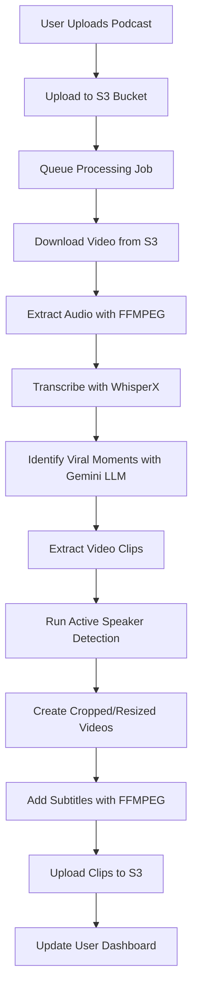
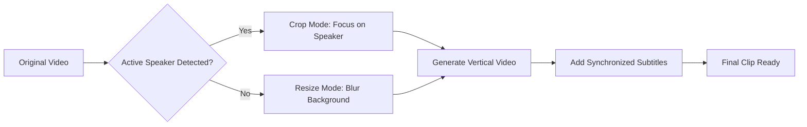

# 🎬 Clipify - AI-Powered Podcast to Short-Form Video Converter

> **🚧 Work in Progress** - Building the future of podcast content creation with AI

[](https://python.org)
[](https://aws.amazon.com)
[](https://nextjs.org)
[](https://fastapi.tiangolo.com)
[](https://typescriptlang.org)
[](https://opencv.org)
[](https://pytorch.org)
[](https://developer.nvidia.com/cuda-zone)
[](https://openai.com/whisper)
[](https://ai.google.dev)
[](https://stripe.com)

## 🎯 Project Overview

Clipify is a cutting-edge SaaS application that automatically transforms full-length podcasts into viral short-form clips optimized for TikTok, YouTube Shorts, and other vertical video platforms. Using advanced AI models for transcription, active speaker detection, and viral moment identification, Clipify streamlines the content creation process for podcasters and content creators.

### 🌟 Key Highlights

- **AI-Powered Viral Detection**: Uses Gemini LLM to identify the most engaging moments in podcasts
- **Smart Video Cropping**: Active speaker detection with face tracking for optimal framing
- **Professional Subtitles**: Automatically generated and styled subtitles with perfect timing
- **Production-Ready SaaS**: Complete authentication, payment processing, and queue management
- **GPU-Accelerated Processing**: High-performance computing for efficient video rendering
- **Scalable Architecture**: Built to handle high user loads with background processing

## 🚀 Features

### 🤖 AI & Machine Learning
- 🎬 **Auto-detection of viral moments** in podcasts (stories, questions, dramatic moments)
- 🎯 **Active speaker detection** for intelligent video cropping using Junhua-Liao/LR-ASD
- 📝 **High-quality transcription** with m-bain/whisperX
- 🧠 **LLM-powered content analysis** with Gemini API for viral moment identification

### 🎥 Video Processing
- 📱 **Clips optimized for vertical platforms** (TikTok, YouTube Shorts - 1080x1920)
- 🔊 **Automatically added subtitles** with custom styling and timing
- 🎞️ **GPU-accelerated video rendering** with FFMPEGCV
- 🎨 **Smart cropping modes**: Focus on active speaker or resize with blur background
- 🎵 **Audio synchronization** with processed video clips

### 💼 SaaS Features
- 👤 **User authentication system**
- 💳 **Credit-based payment system** with Stripe integration
- 📊 **Queue system with Inngest** for handling concurrent user requests
- 🌐 **RESTful FastAPI backend** for robust podcast processing
- 📱 **Responsive Next.js web interface** with modern UI
- 🎛️ **User dashboard** for uploading podcasts and managing clips
- ⏱️ **Background processing** for long-running video operations

### 🏗️ Infrastructure
- ⚡ **GPU-accelerated processing** for high-performance computing
- 🗄️ **AWS S3 integration** for scalable file storage
- 🔐 **Secure authentication** and request validation
- 🔄 **Asynchronous processing** with job queues

## 🏛️ System Architecture

### Core Processing Pipeline



### Video Processing Workflow



## 🛠️ Technology Stack

### Frontend
- **Next.js 15** - React framework with App Router
- **TypeScript** - Type-safe development
- **Tailwind CSS** - Utility-first styling
- **Shadcn UI** - Modern component library
- **Auth.js** - Authentication solution

### Backend
- **Python 3.9+** - Core processing language
- **FastAPI** - High-performance API framework
- **GPU Computing** - High-performance video processing
- **Inngest** - Background job processing

### AI & Machine Learning
- **m-bain/whisperX** - Advanced speech transcription
- **Junhua-Liao/LR-ASD** - Active speaker detection model
- **Google Gemini API** - Large language model for content analysis
- **OpenCV** - Computer vision processing
- **FFMPEG/FFMPEGCV** - Video processing and rendering

### Infrastructure & Services
- **AWS S3** - Scalable object storage
- **Stripe** - Payment processing

## 📁 Project Structure

```
Clipify/
├── clipifyapp-backend/          # Python backend services
│   ├── asd/                     # Active Speaker Detection module
│   │   ├── model/               # ML models (Encoder, Classifier)
│   │   ├── utils/               # Processing utilities
│   │   └── weight/              # Model weights
│   ├── main.py                  # FastAPI application entry point
│   ├── ytdownload.py            # YouTube integration utilities
│   └── requirements.txt         # Python dependencies
└── README.md                    # Project documentation
```

## 🚧 Development Status

### ✅ Completed Components
- [x] Active Speaker Detection model integration
- [x] Core ML pipeline structure
- [x] FastAPI backend foundation
- [x] Video processing utilities
- [x] Project architecture design

### 🔄 In Progress
- [ ] Frontend Next.js application
- [ ] User authentication system
- [ ] Stripe payment integration
- [ ] S3 storage integration
- [ ] Inngest queue system
- [ ] Complete video processing pipeline

### 📋 Upcoming Features
- [ ] User dashboard and clip management
- [ ] Advanced subtitle customization
- [ ] Batch processing capabilities
- [ ] Analytics and usage tracking
- [ ] Mobile app (future consideration)

## 🎬 How It Works

1. **Upload**: Users upload full podcast videos through the web interface
2. **Queue**: Video processing is queued using Inngest for scalable handling
3. **Transcribe**: Audio is extracted and transcribed using WhisperX
4. **Analyze**: Gemini LLM analyzes the transcript to identify viral moments
5. **Detect**: Active speaker detection runs on identified video segments
6. **Process**: Videos are cropped/resized and optimized for vertical format
7. **Subtitle**: Synchronized subtitles are added with custom styling
8. **Deliver**: Processed clips are uploaded to S3 and made available to users

## 🔮 Vision

Clipify aims to democratize viral content creation by making it effortless for podcasters to repurpose their long-form content into engaging short clips. By leveraging cutting-edge AI and providing a seamless user experience, we're building the go-to platform for podcast content optimization.

## 📧 Contact

For questions about this project or collaboration opportunities, feel free to reach out!

---

**⚡ Built with passion for AI and content creation**

> This project showcases advanced skills in full-stack development, AI/ML integration, and scalable SaaS architecture. Currently under active development with regular updates and new features being added.
